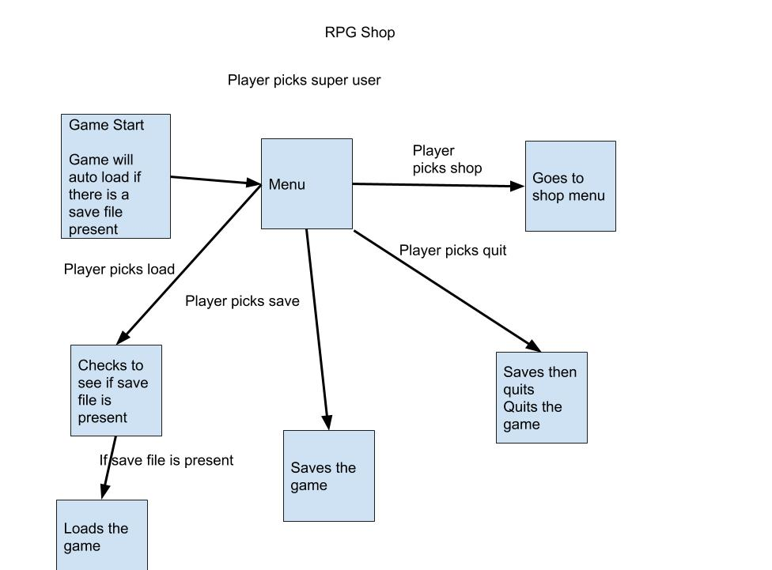
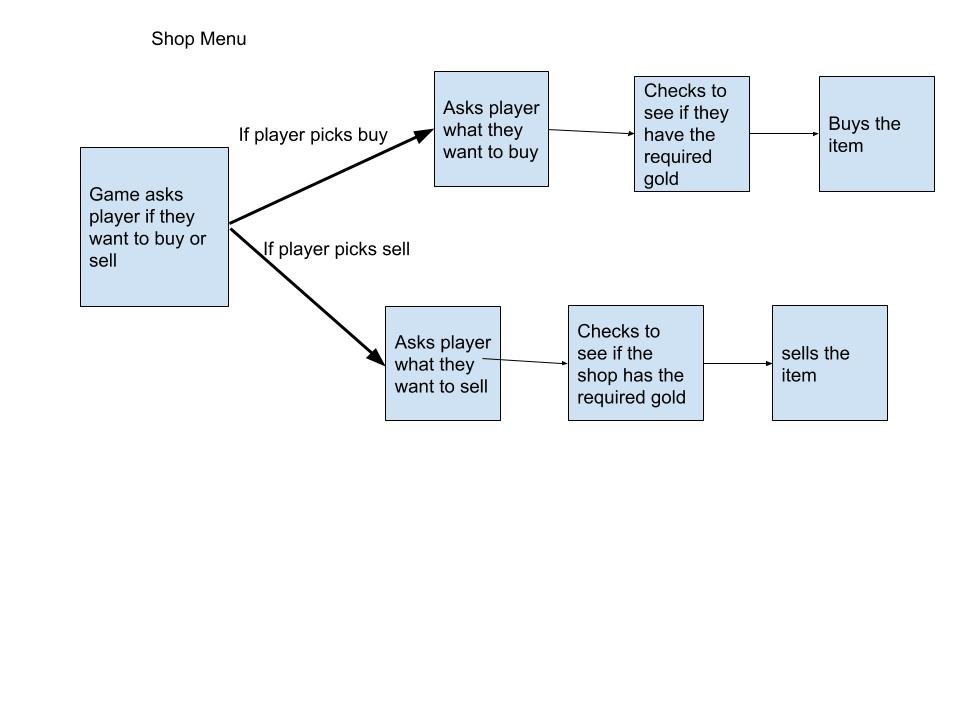

| Sean Eastin
:-
| s18013
| Introduction to C# aassesssment
|RPG SHop

## I. Requirements

1. Description of Problem
- **Name**: RPGSHOP
- **Problme Statement**: create a text based prg shop using the c# language

- **Problem Specifications**: the game must include a dynamic array

2. Input Information
- the user uses a keyboard to enter responses.

3. Output Information

-the game begins on a menu which will ask the user what they want to do from here the user can enter the shop, look at their inventory, save or load and if they type in 484 they will be taken to the superuser menu

-the shop menu will ask the user if they want to sell or buy items. if the player cannot afford items or the shop cannot afford the users items then they cannot complete the transaction

-the superuser menu allows users to add gold to the player and create their own items.

4. User Interface Information
- the program displays everything in a console

## II. Design

1. System Architecture

|Game Diagram
|:-

for when the player starts the game

|Shop Menu
|:-

when the player enters the shop this happens

2. Known Bugs
    - when loading and saving it will ask you to press any key to continue it will ask you this twice due to the way i made the save and load functions
    - if you enter anything incorrect such as in the superuser function if you enter a string into int32 it will crash.

### Object Information

**File**: program.cs

**File**: game.cs

Description: where most of the game is run
**Atrributes**

Name: playerchoice
description: mainly used when the player needs to choose an option.
type : string

Name: playerchoice2
description: same as above but is used in the superuser function because i need to store playerchoice without changing it.
type : string

Name : playergold
Description : holds the players gold
Type: int

Name : shopgold
Description : holds the shops gold
Type: int

Name : validchoice
Description : used in almost all while loops to prevent the person from entering in something that is not an option in the menus
type : bool

Name : gameisrunning
Description : used to keep the game running.
type : bool

Name : playerinv
Description : holds the players inventory.
type: inventory

Name : shopinv
Description : holds the players inventory.
type: inventory

Name: Start
Description where the game starts. if there is no save file present it will create weapons and set up the game.
otherwise it will load the save file.
type: function

Name : Printinventory
Description : prints the players inventory and gold
type : function

Name : Printshopinventory
Description : prints the shop inventory
type : function

Name: Menu
Description : the main menu for the program from here evrything else can be accessed also on the menu type 484 to go to the superuser menu.
type : function

Name : Superuser
description: the superuser menu used to add gold or even add custom items into the game.
type: function

Name : superuseradditems
Description : this allows the player to make custom items and add them to either the shop or player inventory.
type: function

Name : planyergold
Description : propertyu to change the players gold
type : property

Name : shopGold
Description : same as above but for shop gold instead

Name : Save
description : saves the game this is also run when you exit the game
type : function

Name : Load
description : loads the game this is also run at the start of the game if there is a save file present
type : function

Name : shop
description : this opens up the shop menu from there you can buy items from the shop or sell to the shop
type : function

Name : buy
description : this option allows the user to buy items from the shop inventory.
type : function

Name : sell
description : this option allows the user to sell items to the shop inventory
type : function

**File** Item.cs
Description : is an item constructor weapon and potion inherit from this.

name : _name
description : the name of the item
type : string
protection : private

name : _cost
description : the items cost
type : int
protection : private

name: _description
description : this is the items description
type: string
protection: private

name: Item
description this is a constructor that uses name cost and description which when passed in will fill out the private variables
type: constructor

name: printname
description: prints the name of the item
type : property

name: cost
desription: used to return the cost of an item
type: property

name: description
description: returns the items description
type: property

name: itemtype
description: returns the items type.
type: property

name: damage
description: returns the items damage.
type: function

name: healthrestored
description: returns the amount of health an item restores.
type: function

**File** potion.cs
description : this inherits from item.cs 

name : healthrestored
description: this returns the amount of health a potion restores.
type: function

**File** weapon.cs
description : this inherits from item.cs

name :  damage
description : returns the items damage.
type: function
**File** Inventory.cs
description : contains a dynamic array

name : ArrayList
description:
type: function

name: remove
description: removes an item from the array
type: function

name: add
description: adds an item from the array
type: function

name: Clear
description: clears the array
type: function

name: this
description:
type: property

name: print
description: prints the items name with a number
type: function

name: Length
description: returns the Length of the array
type: property

name: GetItem
description:
type: function